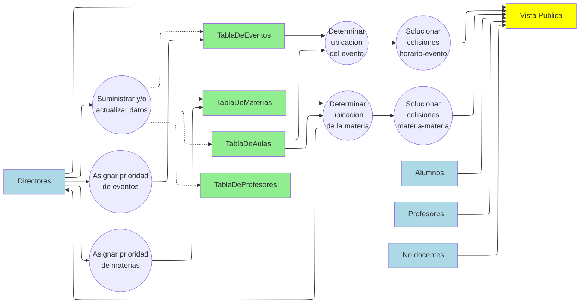

## ¡Hola!
Aca vamos a tratar de reunir toda la informacion acerca de la materia de Ingenieria de Software, incluida en el programa de la carrera de Ingenieria en Computacion dictada en la Universidad Nacional de Rio Negro.
## ¿De que trata esta materia?
Esta materia comprende la totalidad del desarrollo de un software, yendo desde la documentacion y practicas sociales, hasta la aplicacion del mismo.
## ¿Que podemos encontrar en esta organizacion?
Aca vas a encontrar gente comprometida, que busca en cada trabajo sacar lo mejor de si. En los repositorios vas a ver contenido relacionado al proyecto que se este llevando a cabo en la catedra del presente año.
### DFD (Diagrama de flujo de datos)

